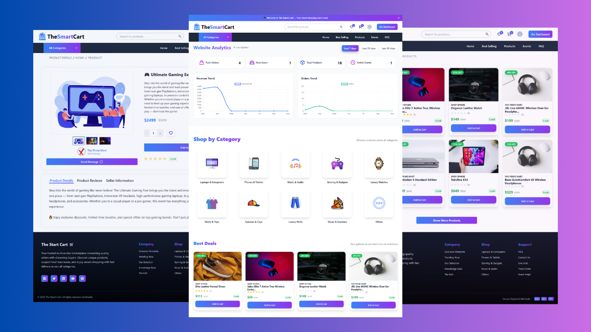

# The Smart Cart | Multivendor E-Commerce

**The Smart Cart** is a next-generation **multivendor e-commerce platform** powered by the **MERN stack**.  
It empowers sellers with independent product catalogs, pricing flexibility, and streamlined order management — while giving buyers a fast, secure, and engaging shopping experience.

From intuitive store management to real-time vendor communication and smooth checkout, every feature is designed to blend **scalability, simplicity, and innovation** in one platform.



<br />

<p align="center">
  <!-- 🌍 Live Project -->
  <a href="https://the-smart-cart.vercel.app/" target="_blank">
    
  </a>

  <!-- ▶️ Live Demo (YouTube) -->
  <a href="https://www.youtube.com/watch?v=LEikMPo9M3A" target="_blank">
    
  </a>

  <!-- 📂 GitHub Repo -->
  <a href="https://github.com/adilarain00/the-smart-cart" target="_blank">
    
  </a>

  <!-- 📝 Case Study (Portfolio) -->
  <a href="https://aadil-amjad.me/project/the-smart-cart" target="_blank">
    
  </a>

  <!-- ✍️ Blog (Portfolio) -->
  <a href="https://aadil-amjad.me/blog/the-smart-cart" target="_blank">
    
  </a>

  <!-- 🔗 LinkedIn Post -->
  <a href="#" target="_blank">
    
  </a>
</p>

---

## Tech Stack

- **🎨 Frontend:** React JS, Tailwind CSS, Redux Toolkit, React Router DOM, Framer Motion
- **⚙️ Backend:** Node.js, Express.js, MongoDB
- **🔐 Authentication & Security:** JWT (JSON Web Token)
- **💳 Payments:** Stripe, PayPal, Cash on Delivery
- **☁️ Media Storage:** Cloudinary
- **💬 Real-time Communication:** Socket.io
- **📧 Email Service:** NodeMailer
- **🚀 Deployment:** Vercel

---

## Features

### 👤 User Features

- 🔐 Secure authentication & authorization
- 🛍️ Browse products with featured items & limited-time deals
- ❤️ Wishlist & cart with real-time updates
- 🎟️ Apply coupons during checkout
- 💳 Multiple payment methods: Stripe, PayPal, COD
- 📦 Track orders, request refunds & view purchase history
- ⭐ Verified product reviews
- 💬 Real-time chat with vendors (text + images)

### 🏪 Vendor Features

- 📦 Create, edit & manage product listings
- 🎉 Launch promotional events & custom coupons
- 📊 Vendor dashboard with sales, orders & earnings stats
- 💰 Request payouts with multiple withdrawal options
- 🚚 Manage orders with fulfillment tracking

### ⚙️ System Features

- 📈 Real-time analytics dashboard
- 🔢 Live counters for orders, users, products & events
- 📊 Dynamic charts for revenue & order volumes
- 🔍 Paginated listings & advanced search filters
- 📱 Fully responsive, scalable, and optimized design

---

## File & Folder Structure

```plaintext
client/
├── public/                    # Static files (index.html, favicon, etc.)
├── src/
│ ├── assets/                  # Images & icons
│ ├── static/                  # Constants, static data
│ ├── redux/                   # Redux Toolkit slices & store
│ ├── routes/                  # Route definitions
│ ├── pages/                   # Application pages (user, vendor, admin)
│ ├── components/              # Reusable UI components
│ ├── App.js                   # Main app entry
│ └── index.js                 # React DOM entry point

api/
├── controllers/               # Backend logic (auth, products, orders, etc.)
├── models/                    # Mongoose schemas
├── routes/                    # Express routes
├── db/                        # Database connection
├── middleware/                # Auth & validation middleware
├── utils/                     # Utility functions & error handlers
├── .env                       # Environment variables
└── index.js                   # Server entry point

socket/
├── index.js                   # Socket.io server
├── package.json
└── .env
```

---

## Conclusion

The **Smart Cart** is a scalable multivendor e-commerce platform that unites secure payments, real-time communication, and data-driven analytics into one seamless ecosystem. Built with trust and performance at its core, it empowers buyers with transparency and vendors with efficiency. More than just code, it reflects a **product-first mindset** — solving real marketplace challenges with **modern, user-centric solutions**.

---

## Contact

<p align="center">
  <a href="https://aadil-amjad.me" target="_blank">
    
  </a>
  <a href="https://www.linkedin.com/in/adilarain00" target="_blank">
    
  </a>
  <a href="https://github.com/adilarain00" target="_blank">
    
  </a>
  <a href="mailto:addilarain00@gmail.com">
    
  </a>
</p>
